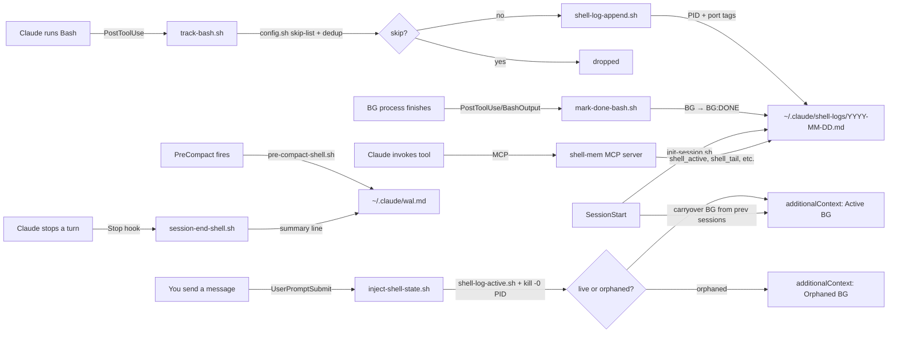

<div align="center">
  <svg xmlns="http://www.w3.org/2000/svg" viewBox="0 0 64 64" width="128" height="128">
    <!-- Background -->
    <rect width="64" height="64" fill="#0d1117"/>
    <!-- Terminal window top bar -->
    <rect x="4" y="4" width="56" height="8" fill="#21262d" rx="1"/>
    <!-- Traffic lights -->
    <rect x="8"  y="7" width="3" height="3" fill="#ff5f57" rx="1"/>
    <rect x="14" y="7" width="3" height="3" fill="#febc2e" rx="1"/>
    <rect x="20" y="7" width="3" height="3" fill="#28c840" rx="1"/>
    <!-- Prompt line 1: > _ -->
    <rect x="8"  y="16" width="3" height="5" fill="#238636"/>
    <rect x="14" y="16" width="6" height="5" fill="#3fb950"/>
    <rect x="22" y="16" width="12" height="5" fill="#3fb950"/>
    <!-- Cursor blink -->
    <rect x="36" y="16" width="3" height="5" fill="#3fb950" opacity="0.7"/>
    <!-- Prompt line 2: BG marker -->
    <rect x="8"  y="24" width="3" height="4" fill="#238636"/>
    <rect x="14" y="24" width="4" height="4" fill="#58a6ff"/>
    <rect x="20" y="24" width="4" height="4" fill="#58a6ff"/>
    <rect x="26" y="24" width="8" height="4" fill="#3fb950"/>
    <!-- Memory chip icon (bottom area) -->
    <rect x="8"  y="32" width="20" height="12" fill="#161b22" rx="1"/>
    <rect x="10" y="34" width="16" height="8"  fill="#21262d" rx="1"/>
    <!-- Chip pins left -->
    <rect x="4" y="33" width="4" height="2" fill="#3fb950"/>
    <rect x="4" y="37" width="4" height="2" fill="#3fb950"/>
    <rect x="4" y="41" width="4" height="2" fill="#3fb950"/>
    <!-- Chip pins right -->
    <rect x="24" y="33" width="4" height="2" fill="#3fb950"/>
    <rect x="24" y="37" width="4" height="2" fill="#3fb950"/>
    <rect x="24" y="41" width="4" height="2" fill="#3fb950"/>
    <!-- WAL stream (right side) -->
    <rect x="36" y="32" width="20" height="2" fill="#388bfd" opacity="0.6"/>
    <rect x="36" y="36" width="16" height="2" fill="#388bfd" opacity="0.4"/>
    <rect x="36" y="40" width="18" height="2" fill="#388bfd" opacity="0.5"/>
    <rect x="36" y="44" width="12" height="2" fill="#388bfd" opacity="0.3"/>
    <!-- Bottom label dots -->
    <rect x="8"  y="48" width="4" height="4" fill="#3fb950" rx="1"/>
    <rect x="16" y="48" width="4" height="4" fill="#58a6ff" rx="1"/>
    <rect x="24" y="48" width="4" height="4" fill="#f78166" rx="1"/>
    <rect x="32" y="48" width="4" height="4" fill="#388bfd" rx="1"/>
    <!-- Corner accent -->
    <rect x="52" y="52" width="8" height="8" fill="#238636" rx="1"/>
    <rect x="54" y="54" width="4" height="4" fill="#3fb950" rx="1"/>
  </svg>
</div>

<h1 align="center">diy-claude-mem</h1>

<p align="center">
  Lightweight, zero-dependency shell command memory for Claude Code.<br/>
  Tracks every Bash call, survives <code>/compact</code>, and auto-injects active background processes into context.
</p>

<p align="center">
  
  
  
  
  
</p>

---

## The Problem

Claude Code loses track of background Bash processes after context compaction:

1. `run_in_background: true` calls lose their process context after `/compact`
2. Claude forgets what shells it started — even before compact, within a long session
3. Noisy, repeated trivial commands pollute the context injection

---

## Architecture

```
┌─────────────────────────────────────────────────────────────────────────┐
│                          Claude Code Lifecycle                           │
└──────┬────────────┬─────────────────┬────────────────┬──────────────────┘
       │            │                 │                │
       ▼            ▼                 ▼                ▼
  [SessionStart] [PostToolUse]  [UserPromptSubmit] [PreCompact / Stop]
       │          Bash / BashOutput       │                │
       │            │                    │                │
       ▼            ▼                    │                ▼
  init-session  track-bash.sh            │       pre-compact-shell.sh
       │         (Phase 1+2)             │       session-end-shell.sh
       │            │                   │                │
       │        ┌───┴────────────────┐  │                │
       │        │  Phase 2 filters   │  │                ▼
       │        │  • noise filter    │  │         ~/.claude/wal.md
       │        │  • deduplication   │  │         (WAL snapshot/summary)
       │        │  • PID capture     │  │
       │        │  • port detection  │  │
       │        └───────────┬────────┘  │
       │                    │           │
       ▼                    ▼           │
  shell-log-     shell-log-append.sh    │
  file.sh             │                │
       │               ▼               │
       └──────► ~/.claude/shell-logs/  │
                YYYY-MM-DD.md ◄─────────┘
                     │          inject only if
                     │          active [BG] entries
                     ▼
              inject-shell-state.sh
                     │
                     ▼
           additionalContext → Claude
```



---

## Log Format

```
### Session: abc-123 — 2026-04-15 14:32:00

- [14:32:11] [sid:abc-123] `npm run dev` [BG] [pid:9182] [port:3001] [est:24h]
- [14:33:05] [sid:abc-123] `git status` [est:5m]
- [14:45:00] [sid:abc-123] `npm run dev` [BG:DONE] [pid:9182] [est:24h]
```

**Phase 2 additions** — PID (`[pid:9182]`) and port (`[port:3001]`) are auto-detected from:
- Command-line flags: `--port 3001`, `PORT=3001`, `port=3001`
- Server startup output: `Listening on :3001`, `http://localhost:3001`, `port 3001`

---

## Quick Start

```bash
cd ~/Code/Claude/diy-claude-mem
bash install.sh
```

`install.sh` copies all scripts to `~/.claude/scripts/diy-mem/`, installs the skill, and
registers the 6 hooks in `~/.claude/settings.json` if not already present.

> Restart Claude Code (or open a new session) for hooks to take effect.

---

## Usage

### Humans (terminal)

```bash
# See recent commands
shell-mem tail 50

# Show only active background processes (cross-day)
shell-mem active

# Today's stats: command count, sessions, active BG
shell-mem stats

# Search this week
shell-mem search "docker" week

# Mark a bg process done
shell-mem mark-done <session-id> "npm run dev"

# Help
shell-mem -h
```

### Claude (MCP tools)

Claude uses the `diy-claude-mem` MCP server natively — no path memorization required:

| Tool | Description |
|---|---|
| `shell_tail(n, date)` | Show recent log entries |
| `shell_search(query, scope)` | Search across date ranges |
| `shell_active(days)` | List active BG processes (cross-day, with PID check) |
| `shell_mark_done(session_id, cmd)` | Mark a BG process as finished |
| `shell_cleanup()` | Delete logs older than 60 days |
| `shell_append(session_id, cmd, is_bg)` | Manually append an entry |

Falls back to `shell-mem` CLI if MCP is unavailable.

---

## Phases

| Phase | Status | Description |
|---|---|---|
| 1 | ✅ Done | Hooks, daily logs, duration estimates, auto-injection |
| 1.1 | ✅ Done | MCP server — named tools for Claude |
| 1.2 | ✅ Done | Lock file for concurrent agent safety |
| 1.3 | ✅ Done | Global dispatcher CLI (`shell-mem`) |
| 2 | ✅ Done | PID capture, port detection, noise filter, dedup, WAL integration |
| 2+ | ✅ Done | PID aliveness check (`kill -0`), orphaned BG detection, cross-day active query, session carryover, `active`/`stats` subcommands, user-skip.conf, `shell_active` MCP tool |
| 3 | Planned | AI compression, permanent archive, handoff docs, consolidation |

---

## File Layout

```
diy-claude-mem/
├── scripts/
│   ├── config.sh              <- skip-list + port patterns + user-skip.conf loader
│   ├── shell-mem              <- dispatcher (entry point) — active, stats subcommands
│   ├── shell-log-file.sh
│   ├── shell-log-append.sh    <- Phase 2: port/PID tagging via DIYMEN_PORT env
│   ├── shell-log-active.sh    <- cross-day active BG query primitive
│   ├── shell-log-tail.sh
│   ├── shell-log-search.sh    <- O(1) date calls via find + lexicographic compare
│   ├── shell-log-mark-done.sh
│   ├── shell-log-cleanup.sh
│   └── hooks/
│       ├── track-bash.sh          <- noise filter + dedup + PID/port capture
│       ├── mark-done-bash.sh
│       ├── inject-shell-state.sh  <- kill -0 PID check, orphaned BG detection
│       ├── init-session.sh        <- carryover active BG from previous sessions
│       ├── pre-compact-shell.sh   <- WAL snapshot on PreCompact
│       └── session-end-shell.sh   <- WAL summary on Stop
├── mcp-server/
│   ├── server.js              <- added shell_active tool (v1.1.0)
│   └── package.json
├── skills/
│   └── shell-mem/SKILL.md     <- MCP-first, bash paths as fallback
├── docs/
│   └── idream-integration.md  <- agent-ready i-dream integration guide
├── install.sh
├── PLAN.md
└── .gitignore
```

Logs: `~/.claude/shell-logs/YYYY-MM-DD.md` (60-day retention, not tracked in git)  
WAL: `~/.claude/wal.md` (Phase 2 snapshots and per-turn summaries)

---

## Design Principles

1. **Async wherever possible** — never block Claude's response
2. **Fail silently** — missing files, jq errors: all exit 0
3. **No external deps** — bash + jq only
4. **Scripts are the API** — Claude uses scripts/MCP, never raw file reads
5. **Progressively disclose** — inject only when active BG entries exist
6. **Configurable skip-list** — edit `config.sh` or create `user-skip.conf` alongside it
7. **PID aliveness** — `kill -0 $PID` classifies entries as live vs orphaned without subprocesses
