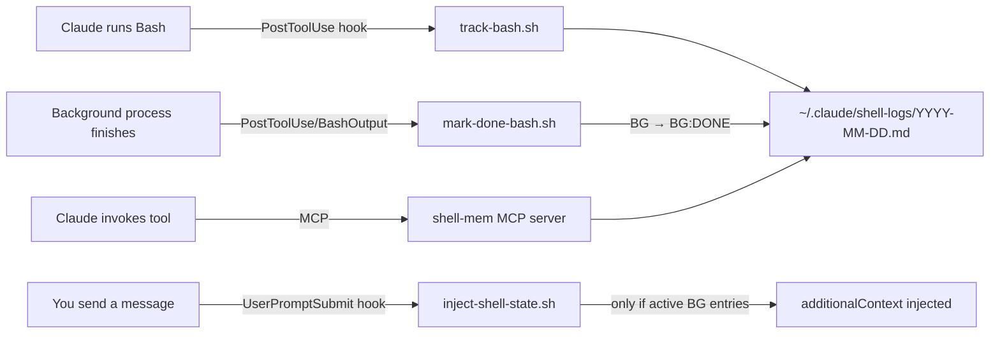

# diy-claude-mem

> Lightweight shell command memory for Claude Code. Zero deps. Survives `/compact`.

Claude Code loses track of background bash processes after context compaction. This system hooks into Claude Code's lifecycle to log every command, track background process status, and auto-inject context when active shells exist.

## Architecture



## Log format

```
### Session: abc-123 — 2026-04-03 14:32:00

- [14:32:11] [sid:abc-123] `npm run dev` [BG] [est:24h]
- [14:33:05] [sid:abc-123] `git status` [est:30s]
- [14:45:00] [sid:abc-123] `npm run dev` [BG:DONE] [est:24h]
```

## Quick start

```bash
cd ~/Code/Claude/diy-claude-mem
bash install.sh
```

Hooks are registered in `~/.claude/settings.json`. MCP server is registered in `~/.claude/mcp.json`.

## Usage (humans)

```bash
# See recent commands
shell-mem tail 50

# Search this week
shell-mem search "docker" week

# Mark a bg process done
shell-mem mark-done <session-id> "npm run dev"

# Help
shell-mem -h
```

## Usage (Claude)

Claude uses MCP tools natively: `shell_tail`, `shell_search`, `shell_mark_done`, `shell_cleanup`, `shell_append`.
Falls back to `shell-mem` CLI if MCP is unavailable.

## Phases

| Phase | Status | Description |
|---|---|---|
| 1 | Done | Hooks, daily logs, duration estimates, auto-injection |
| 1.1 | Done | MCP server -- named tools for Claude |
| 1.2 | Done | Lock file for concurrent agent safety |
| 1.3 | Done | Global dispatcher CLI (`shell-mem`) |
| 2 | Planned | PID capture, noise filter, WAL integration, PreCompact snapshot |
| 3 | Planned | AI compression, permanent archive, handoff docs, consolidation |

## File layout

```
diy-claude-mem/
├── scripts/
│   ├── shell-mem              <- dispatcher (entry point)
│   ├── shell-log-file.sh
│   ├── shell-log-append.sh
│   ├── shell-log-tail.sh
│   ├── shell-log-search.sh
│   ├── shell-log-mark-done.sh
│   ├── shell-log-cleanup.sh
│   └── hooks/
│       ├── track-bash.sh
│       ├── mark-done-bash.sh
│       ├── inject-shell-state.sh
│       └── init-session.sh
├── mcp-server/
│   ├── server.js
│   └── package.json
├── skills/
│   └── shell-mem/SKILL.md
├── install.sh
├── PLAN.md
└── .gitignore
```

Logs: `~/.claude/shell-logs/YYYY-MM-DD.md` (60-day retention, not tracked in git)
