```mermaid
graph LR
    A[Claude runs Bash] -->|PostToolUse| B[track-bash.sh]
    B -->|config.sh + user-skip.conf| C{skip?}
    C -->|no| D[shell-log-append.sh]
    C -->|yes| Z[dropped]
    D -->|PID + port tags| E[~/.claude/shell-logs/YYYY-MM-DD.md]
    F[BG process finishes] -->|PostToolUse/BashOutput| G[mark-done-bash.sh]
    G -->|BG → BG:DONE| E
    H[You send a message] -->|UserPromptSubmit| I[inject-shell-state.sh]
    I -->|shell-log-active.sh + kill -0 PID| I2{live or orphaned?}
    I2 -->|live| J[additionalContext: Active BG]
    I2 -->|orphaned| J2[additionalContext: Orphaned BG]
    K[PreCompact fires] -->|pre-compact-shell.sh| L[~/.claude/wal.md]
    M[Claude stops a turn] -->|Stop hook| N[session-end-shell.sh]
    N -->|summary line| L
    O[SessionStart] -->|init-session.sh| E
    O -->|carryover BG from prev sessions| J
    P[Claude invokes MCP tool] -->|MCP| Q[diy-claude-mem MCP server]
    Q -->|shell_tail / shell_search / shell_active / shell_stats| E
    R[shell-mem CLI] -->|tail / search / active / stats| E
```

<div align="center">
  <svg xmlns="http://www.w3.org/2000/svg" viewBox="0 0 64 64" width="148" height="148">
    <!-- Dark background -->
    <rect width="64" height="64" fill="#0d1117"/>
    <!-- Terminal window frame -->
    <rect x="3" y="3" width="58" height="58" fill="#161b22" rx="3"/>
    <!-- Title bar -->
    <rect x="3" y="3" width="58" height="9" fill="#21262d" rx="3"/>
    <rect x="3" y="9" width="58" height="3" fill="#21262d"/>
    <!-- Traffic light buttons -->
    <circle cx="9"  cy="7.5" r="2" fill="#ff5f57"/>
    <circle cx="15" cy="7.5" r="2" fill="#febc2e"/>
    <circle cx="21" cy="7.5" r="2" fill="#28c840"/>
    <!-- Prompt row 1: > command -->
    <rect x="8"  y="16" width="2" height="4" fill="#28c840"/>
    <rect x="12" y="16" width="14" height="4" fill="#3fb950"/>
    <rect x="28" y="16" width="3"  height="4" fill="#3fb950" opacity="0.6"/>
    <!-- Prompt row 2: [BG] tag -->
    <rect x="8"  y="23" width="2" height="3" fill="#28c840"/>
    <rect x="12" y="23" width="4"  height="3" fill="#58a6ff"/>
    <rect x="18" y="23" width="4"  height="3" fill="#58a6ff"/>
    <rect x="24" y="23" width="4"  height="3" fill="#58a6ff"/>
    <rect x="30" y="23" width="10" height="3" fill="#3fb950"/>
    <!-- Memory chip body -->
    <rect x="7"  y="30" width="22" height="14" fill="#0d1117" rx="2"/>
    <rect x="9"  y="32" width="18" height="10" fill="#1c2128" rx="1"/>
    <!-- Chip label dots -->
    <rect x="12" y="35" width="3" height="3" fill="#3fb950" rx="0.5"/>
    <rect x="18" y="35" width="3" height="3" fill="#58a6ff" rx="0.5"/>
    <rect x="24" y="35" width="3" fill="#f78166" height="3" rx="0.5"/>
    <!-- Chip pins (left) -->
    <rect x="3" y="31" width="4" height="2" fill="#3fb950"/>
    <rect x="3" y="35" width="4" height="2" fill="#3fb950"/>
    <rect x="3" y="39" width="4" height="2" fill="#3fb950"/>
    <!-- Chip pins (right) -->
    <rect x="29" y="31" width="4" height="2" fill="#3fb950"/>
    <rect x="29" y="35" width="4" height="2" fill="#3fb950"/>
    <rect x="29" y="39" width="4" height="2" fill="#3fb950"/>
    <!-- WAL stream lines -->
    <rect x="36" y="30" width="22" height="2" fill="#388bfd" opacity="0.7"/>
    <rect x="36" y="34" width="18" height="2" fill="#388bfd" opacity="0.5"/>
    <rect x="36" y="38" width="20" height="2" fill="#388bfd" opacity="0.6"/>
    <rect x="36" y="42" width="14" height="2" fill="#388bfd" opacity="0.3"/>
    <!-- Inject arrow -->
    <polygon points="34,36 37,34 37,38" fill="#3fb950" opacity="0.8"/>
    <!-- Bottom status row -->
    <rect x="8"  y="49" width="4" height="4" fill="#3fb950" rx="1"/>
    <rect x="15" y="49" width="4" height="4" fill="#58a6ff" rx="1"/>
    <rect x="22" y="49" width="4" height="4" fill="#f78166" rx="1"/>
    <rect x="29" y="49" width="4" height="4" fill="#388bfd" rx="1"/>
    <rect x="36" y="49" width="4" height="4" fill="#febc2e" rx="1"/>
    <!-- Corner pulse dot -->
    <circle cx="56" cy="56" r="3" fill="#28c840" opacity="0.9"/>
    <circle cx="56" cy="56" r="5" fill="none" stroke="#28c840" stroke-width="1" opacity="0.3"/>
  </svg>
</div>

<h1 align="center">diy-claude-mem</h1>

<p align="center">
  Lightweight, zero-dependency shell command memory for Claude Code.<br/>
  Tracks every Bash call, survives <code>/compact</code>, and auto-injects active background
  processes — with PID aliveness checks — into context.
</p>

<p align="center">
  
  
  
  
  
  
</p>

---

## The Problem

Claude Code loses track of background Bash processes after context compaction:

1. `run_in_background: true` calls lose their process context after `/compact`
2. Claude forgets what shells it started — even before compact, within a long session
3. Noisy, repeated trivial commands pollute the context injection

---

## How It Works

```
┌─────────────────────────────────────────────────────────────────────────┐
│                          Claude Code Lifecycle                           │
└──────┬────────────┬─────────────────┬────────────────┬──────────────────┘
       │            │                 │                │
       ▼            ▼                 ▼                ▼
  [SessionStart] [PostToolUse]  [UserPromptSubmit] [PreCompact / Stop]
       │          Bash / BashOutput       │                │
       │            │                    │                │
       ▼            ▼                    │                ▼
  init-session  track-bash.sh            │       pre-compact-shell.sh
       │         (Phase 1+2)             │       session-end-shell.sh
       │            │                   │                │
       │        ┌───┴────────────────┐  │                │
       │        │  Phase 2 filters   │  │                ▼
       │        │  • noise filter    │  │         ~/.claude/wal.md
       │        │  • deduplication   │  │         (WAL snapshot/summary)
       │        │  • PID capture     │  │
       │        │  • port detection  │  │
       │        └───────────┬────────┘  │
       │                    │           │
       ▼                    ▼           │
  shell-log-     shell-log-append.sh    │
  file.sh             │                │
       │               ▼               │
       └──────► ~/.claude/shell-logs/  │
                YYYY-MM-DD.md ◄─────────┘
                     │          inject only if
                     │          active [BG] entries
                     ▼
              inject-shell-state.sh
              (kill -0 PID check)
                     │
            ┌────────┴────────┐
            ▼                 ▼
     live → Claude    orphaned → Claude
     (Active BG)      (Orphaned BG)
```



---

## Log Format

```
### Session: abc-123 — 2026-04-15 14:32:00

- [14:32:11] [sid:abc-123] `npm run dev` [BG] [pid:9182] [port:3001] [est:24h]
- [14:33:05] [sid:abc-123] `git status` [est:5m]
- [14:45:00] [sid:abc-123] `npm run dev` [BG:DONE] [pid:9182] [est:24h]
```

**Phase 2 additions** — PID (`[pid:9182]`) and port (`[port:3001]`) are auto-detected from:

- Command-line flags: `--port 3001`, `PORT=3001`, `port=3001`
- Server startup output: `Listening on :3001`, `http://localhost:3001`, `port 3001`

---

## Quick Start

```bash
cd ~/Code/Claude/diy-claude-mem
bash install.sh
```

`install.sh` copies all scripts to `~/.claude/scripts/diy-mem/`, installs the skill, and
registers the 6 hooks in `~/.claude/settings.json` if not already present.

> Restart Claude Code (or open a new session) for hooks to take effect.

---

## Usage

### Humans (terminal)

```bash
# See recent commands
shell-mem tail 50

# Show only active background processes (cross-day, with PID check)
shell-mem active

# Today's stats: command count, sessions, active/done BG, log size
shell-mem stats

# Search this week
shell-mem search "docker" week

# Mark a bg process done
shell-mem mark-done <session-id> "npm run dev"

# Help
shell-mem -h
```

### Claude (MCP tools)

Claude uses the `diy-claude-mem` MCP server natively — no path memorization required:

| Tool                                   | Description                                                       |
| -------------------------------------- | ----------------------------------------------------------------- |
| `shell_tail(n, date)`                  | Show recent log entries                                           |
| `shell_search(query, scope)`           | Search across date ranges (`today` \| `week` \| `month` \| `all`) |
| `shell_active(days)`                   | List active BG processes (cross-day, with PID aliveness check)    |
| `shell_stats(date?)`                   | Today's command count, sessions, active/done BG, log size         |
| `shell_mark_done(session_id, cmd)`     | Mark a BG process as finished                                     |
| `shell_cleanup()`                      | Delete logs older than 60 days                                    |
| `shell_append(session_id, cmd, is_bg)` | Manually append an entry                                          |

Falls back to `shell-mem` CLI if MCP is unavailable.

---

## Configuration

The skip-list filters noisy, trivial commands from being logged.

**Edit `scripts/config.sh`** to add permanent patterns:

```bash
DIYMEN_SKIP_PATTERNS+=("git status" "ls" "pwd")
```

**Or create `scripts/user-skip.conf`** alongside `config.sh` for personal overrides
(not tracked in git):

```
# user-skip.conf — one pattern per line, comments with #
echo
cat ~/.claude
```

Changes take effect immediately — no restart needed.

---

## Phases

| Phase | Status  | Description                                                                                                                                                                           |
| ----- | ------- | ------------------------------------------------------------------------------------------------------------------------------------------------------------------------------------- |
| 1     | ✅ Done | Hooks, daily logs, duration estimates, auto-injection                                                                                                                                 |
| 1.1   | ✅ Done | MCP server — named tools for Claude                                                                                                                                                   |
| 1.2   | ✅ Done | Lock file for concurrent agent safety                                                                                                                                                 |
| 1.3   | ✅ Done | Global dispatcher CLI (`shell-mem`)                                                                                                                                                   |
| 2     | ✅ Done | PID capture, port detection, noise filter, dedup, WAL integration                                                                                                                     |
| 2+    | ✅ Done | PID aliveness (`kill -0`), orphaned BG detection, cross-day active query, session carryover, `active`/`stats` subcommands, `user-skip.conf`, `shell_active` + `shell_stats` MCP tools |
| 3     | Planned | AI compression, permanent archive, handoff docs, consolidation                                                                                                                        |

---

## File Layout

```
diy-claude-mem/
├── scripts/
│   ├── config.sh              ← skip-list, port patterns, user-skip.conf loader
│   ├── shell-mem              ← dispatcher CLI (tail/search/active/stats/…)
│   ├── shell-log-file.sh      ← resolve today's log path
│   ├── shell-log-append.sh    ← write entries (PID + port tagging)
│   ├── shell-log-active.sh    ← cross-day active BG query primitive
│   ├── shell-log-stats.sh     ← stats: command count, sessions, BG summary
│   ├── shell-log-tail.sh
│   ├── shell-log-search.sh    ← O(1) date calls via find + lex compare
│   ├── shell-log-mark-done.sh
│   ├── shell-log-cleanup.sh
│   └── hooks/
│       ├── track-bash.sh           ← noise filter + dedup + PID/port capture
│       ├── mark-done-bash.sh
│       ├── inject-shell-state.sh   ← kill -0 PID check, orphaned BG detection
│       ├── init-session.sh         ← carryover active BG from previous sessions
│       ├── pre-compact-shell.sh    ← WAL snapshot on PreCompact
│       └── session-end-shell.sh    ← WAL summary on Stop
├── mcp-server/
│   ├── server.js              ← MCP server v1.2.0 (7 tools)
│   └── package.json
├── skills/
│   └── shell-mem/SKILL.md     ← Claude reference card (MCP-first, bash fallback)
├── docs/
│   └── idream-integration.md  ← agent-ready i-dream integration guide
├── install.sh
├── PLAN.md
└── .gitignore
```

Logs: `~/.claude/shell-logs/YYYY-MM-DD.md` (60-day retention, not tracked in git)  
WAL: `~/.claude/wal.md` (Phase 2 snapshots and per-turn summaries)

---

## Design Principles

1. **Async wherever possible** — never block Claude's response
2. **Fail silently** — missing files, jq errors: all exit 0
3. **No external deps** — bash + jq only (MCP server: Node.js with `@modelcontextprotocol/sdk`)
4. **Scripts are the API** — Claude uses scripts/MCP, never raw file reads
5. **Progressively disclose** — inject only when active BG entries exist
6. **Configurable skip-list** — edit `config.sh` or drop a `user-skip.conf` alongside it
7. **PID aliveness** — `kill -0 $PID` classifies entries as live vs orphaned without spawning subprocesses

---

## Documentation

| Document                                          | Description                                                        |
| ------------------------------------------------- | ------------------------------------------------------------------ |
| [PLAN.md](PLAN.md)                                | Full 3-phase implementation plan and Phase 2+ improvement log      |
| [Shell Memory Skill](skills/shell-mem/SKILL.md)   | MCP tools reference card with bash fallbacks                       |
| [i-dream Integration](docs/idream-integration.md) | How to connect shell logs with the i-dream subconsciousness daemon |

---

## Contributing

Contributions welcome — open an issue or pull request on [GitHub](https://github.com/alcatraz627/diy-claude-mem).
